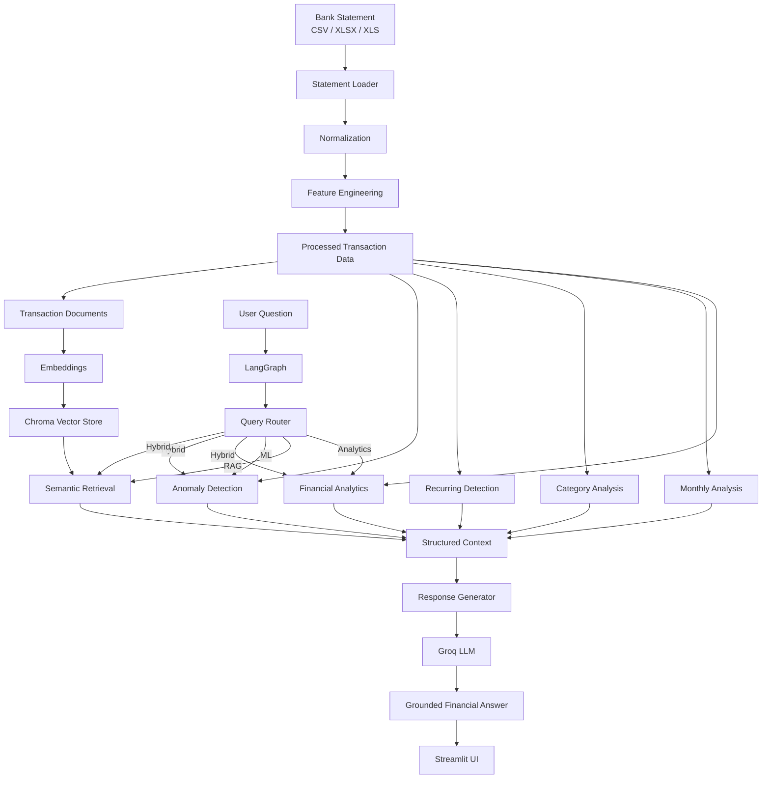

#  FinNexus - Financial Retrieval & Analytics System

> **An AI-powered bank statement analysis system combining deterministic financial analytics, feature engineering, anomaly detection, semantic transaction retrieval, and LangGraph-based question routing.**

**Repository:** [ImNirajsingh/FinNexus](https://github.com/ImNirajsingh/FinNexus)

---

## Overview

**FinNexus** is a modular financial intelligence system designed to transform raw bank statements into structured, analyzable financial data and provide an AI-powered interface for exploring transactions.

The system combines traditional data analytics with modern AI techniques:

*  **Bank statement ingestion**
*  **Transaction normalization and cleaning**
*  **Financial feature engineering**
*  **Financial analytics**
*  **Monthly trend analysis**
*  **Category-level analysis**
*  **Recurring transaction detection**
*  **Machine-learning-based anomaly detection**
*  **Semantic transaction search using RAG**
*  **LangGraph-based query routing**
*  **LLM-powered grounded responses**
*  **Streamlit interactive dashboard**

The central design principle is:

> **Use deterministic Python analytics as the source of truth for numerical financial information, and use the LLM primarily for interpreting and communicating verified results.**

This prevents the language model from independently inventing transaction amounts, dates, balances, or financial statistics.

---

# Problem Statement

Bank statements contain large amounts of semi-structured transactional information.

A typical statement may contain:

* Transaction dates
* Value dates
* Descriptions
* Reference numbers
* Debit/credit indicators
* Transaction amounts
* Account balances
* Payment channels
* Merchant/counterparty information

Although the data is highly valuable, manually answering questions such as:

> How much did I spend this month?

> What were my largest expenses?

> Which transactions were made to a particular merchant?

> Which transactions look unusual?

> What are my recurring payments?

> Why did my expenses increase?

can become difficult when a statement contains hundreds or thousands of transactions.

The purpose of this project is to build a reusable pipeline that converts the statement into a structured financial representation and exposes that information through both:

1. **Deterministic analytics**
2. **Natural-language AI interaction**

---

# Key Capabilities

| Capability              | Description                                                            |
| ----------------------- | ---------------------------------------------------------------------- |
|  Statement ingestion  | Load CSV and Excel bank statements                                     |
|  Schema normalization | Convert different bank column names into a canonical schema            |
|  Data cleaning        | Normalize dates, amounts and transaction types                         |
|  Feature engineering  | Generate temporal, balance and transaction-derived features            |
|  Financial metrics    | Calculate income, expenses, cash flow and transaction statistics       |
|  Monthly analysis     | Analyze income, expenses and transaction activity over time            |
|  Category analysis   | Aggregate transactions by financial category                           |
|  Recurring detection  | Identify repeated transactions and estimate frequency                  |
|  Anomaly detection    | Detect unusual transactions using Isolation Forest                     |
|  Semantic search      | Search transactions using natural-language queries                     |
|  RAG                  | Retrieve relevant transaction records before generating answers        |
|  Query routing        | Route questions to analytics, RAG, ML or hybrid workflows              |
|  LLM responses        | Convert verified structured results into natural-language explanations |
|  Dashboard           | Explore uploaded statements through Streamlit                          |

---

# System Architecture

The project follows a modular architecture where each responsibility is separated into its own package.



---

# End-to-End Data Flow

The application processes an uploaded statement through several stages.

```text
Bank Statement
      │
      ▼
┌─────────────────────┐
│ Statement Ingestion │
└──────────┬──────────┘
           │
           ▼
┌──────────────────────────┐
│ Schema Normalization     │
│ dates / amounts / types  │
└──────────┬───────────────┘
           │
           ▼
┌──────────────────────────┐
│ Feature Engineering      │
│ temporal / balance /     │
│ description features     │
└──────────┬───────────────┘
           │
           ├───────────────► Financial Analytics
           │
           ├───────────────► Monthly Analysis
           │
           ├───────────────► Category Analysis
           │
           ├───────────────► Recurring Detection
           │
           ├───────────────► Anomaly Detection
           │
           └───────────────► RAG / Vector Search
                                      │
                                      ▼
                              Relevant Transactions
                                      │
                                      ▼
User Question ──► Query Router ──► Execution Path
                                      │
                                      ▼
                              Structured Context
                                      │
                                      ▼
                              Response Generator
                                      │
                                      ▼
                                Groq LLM
                                      │
                                      ▼
                              Final AI Answer
```

---

# 📁 Project Structure

```text
Bank-Statement-AI-Analyzer/
│
├── README.md
├── requirements.txt
├── .gitignore
├── .env.example
│
├── app/
│   └── streamlit_app.py
│
├── src/
│   ├── __init__.py
│   │
│   ├── analytics/
│   │   ├── category_analysis.py
│   │   ├── financial_metrics.py
│   │   ├── monthly_analysis.py
│   │   └── recurring.py
│   │
│   ├── graph/
│   │   ├── financial_graph.py
│   │   ├── query_router.py
│   │   ├── route_executor.py
│   │   └── state.py
│   │
│   ├── ingestion/
│   │   └── statement_loader.py
│   │
│   ├── llm/
│   │   ├── groq_client.py
│   │   └── response_generator.py
│   │
│   ├── ml/
│   │   └── anomaly_detection.py
│   │
│   ├── preprocessing/
│   │   ├── cleaning.py
│   │   ├── description_features.py
│   │   ├── feature_engineering.py
│   │   ├── uploaded_statement_features.py
│   │   └── update_transaction_features.py
│   │
│   ├── rag/
│   │   ├── check_vectorstore.py
│   │   ├── documents.py
│   │   ├── embeddings.py
│   │   ├── retriever.py
│   │   └── vectorstore.py
│   │
│   └── utils/
│       └── config.py
│
├── notebooks/
│   ├── 01_preprocessing.ipynb
│   ├── 02_feature_engineering.ipynb
│   ├── 03_eda.ipynb
│   ├── 04_ml_anomaly_detection.ipynb
│   └── 05_rag_evaluation.ipynb
│
└── tests/
    └── test_analytics.py
```

> **Implementation note:** the current Streamlit application also imports `src.rag.uploaded_retriever`, which is not shown in the structure above. If that module is part of the current working tree, it should be included in the repository tree as well.

---

# Architecture Layers

The application can be understood as seven major layers.

### 1. Ingestion Layer

Responsible for reading bank statements and converting them into DataFrames.

```text
Bank CSV / Excel
       ↓
statement_loader.py
       ↓
Raw DataFrame
```

### 2. Preprocessing Layer

Responsible for converting inconsistent bank data into a predictable transaction representation.

```text
Raw DataFrame
      ↓
Normalization
      ↓
Feature Engineering
      ↓
Analysis-ready DataFrame
```

### 3. Analytics Layer

Provides deterministic calculations.

```text
Analysis-ready DataFrame
        │
        ├── Financial Metrics
        ├── Monthly Analysis
        ├── Category Analysis
        └── Recurring Transactions
```

### 4. Machine Learning Layer

Detects potentially unusual transactions.

```text
Transaction Features
        ↓
Isolation Forest
        ↓
Anomaly Score / Rank
```

### 5. RAG Layer

Converts transactions into searchable documents and retrieves semantically relevant transactions.

```text
Transactions
    ↓
LangChain Documents
    ↓
Embeddings
    ↓
Chroma
    ↓
Similarity Search
```

### 6. Agent / Graph Layer

Determines which capability should answer the user's question.

```text
User Query
    ↓
Query Router
    ↓
Analytics / RAG / ML / Hybrid
```

### 7. LLM Layer

Transforms verified structured context into a readable answer.

```text
Structured Context
       ↓
Response Generator
       ↓
Groq
       ↓
Natural Language Response
```

---

# 1. Statement Ingestion

The ingestion module is located at:

```text
src/ingestion/statement_loader.py
```

Its purpose is to make the application robust against differences in bank statement formats.

The loader supports:

* CSV
* XLSX
* XLS

The Streamlit application passes uploaded files directly to:

```python
load_statement(uploaded_file)
```

followed by:

```python
normalize_statement(raw_df)
```

The loader contains column aliases and normalization logic for common bank fields such as:

```text
Transaction Date
Value Date
Description
Chq /Ref No.
Amount
Dr / Cr
Balance
```

These are converted into a consistent internal representation.

---

# Handling Imperfect CSV Files

Bank exports are not always clean CSV files.

The ingestion implementation contains additional handling for malformed CSV input, including:

* empty files
* placeholder content
* encoding issues
* comments
* irregular row lengths
* malformed headers
* merged header/data rows
* reconstructed CSV rows

The loader can therefore attempt to repair certain malformed statement structures before failing.

This is particularly important because financial data exported from different banking systems can have significantly different layouts.

---

# 2. Data Normalization

After loading, the statement is converted into a canonical schema.

A representative internal structure is:

```text
transaction_id
transaction_datetime
value_date
description
reference_no
amount
transaction_type
balance
balance_type
```

The normalization process also converts:

### Dates

```python
pd.to_datetime(...)
```

### Amounts

```python
pd.to_numeric(...)
```

### Transaction types

```text
CR
DR
```

The analytics modules also contain their own normalization helpers so that they can accept both raw bank-export columns and already-normalized transaction DataFrames.

---

# 3. Feature Engineering

Feature engineering is performed primarily through:

```text
src/preprocessing/uploaded_statement_features.py
src/preprocessing/description_features.py
```

The uploaded-statement feature pipeline creates temporal and financial features from the normalized transaction table.

---

## Temporal Features

For each transaction, the pipeline derives:

```text
date
year
month
month_name
day
day_of_week
hour
```

For example:

```text
transaction_datetime
        ↓
2026-09-15 14:32:00
        ↓
year = 2026
month = 9
day = 15
day_of_week = Tuesday
hour = 14
```

These features can later be used for:

* monthly analysis
* behavioral analysis
* anomaly detection
* transaction timing analysis

---

# Amount Features

The system generates:

```text
amount_abs
signed_amount
```

`amount_abs` represents the absolute transaction value.

`signed_amount` represents cash-flow direction:

```text
Credit → positive
Debit  → negative
```

This makes it possible to calculate:

```text
Net Cash Flow
=
Total Income - Total Expense
```

---

# Balance Consistency Features

The feature pipeline also derives:

```text
previous_balance
balance_change
expected_balance
balance_difference
```

Conceptually:

```text
Expected Balance
=
Previous Balance + Signed Transaction Amount
```

Then:

```text
Balance Difference
=
Actual Balance - Expected Balance
```

This provides an additional consistency signal for transaction-level analysis.

---

# High-Value Transaction Detection

The application calculates a high-value threshold using the 95th percentile of absolute transaction amounts:

```python
threshold = amount_abs.quantile(0.95)
```

Transactions at or above this threshold are marked:

```text
is_high_value = True
```

This is a statistical flag rather than a fraud classification.

---

# Transaction Timing Features

The pipeline calculates:

```text
days_since_previous_transaction
```

This measures the elapsed time between consecutive transactions.

It is later used by the anomaly detection system.

---

# Description Features

The module:

```text
src/preprocessing/description_features.py
```

extracts structured information from transaction descriptions.

It provides:

### Description cleaning

```text
description_clean
```

### Payment mode

The implementation recognizes payment modes including:

```text
UPI
NEFT
IMPS
RTGS
ATM
POS
CASH
CHEQUE
UNKNOWN
```

### Counterparty

The system attempts to extract counterparties from transaction descriptions.

### Merchant

For supported UPI description formats, merchant information can also be extracted.

This converts an unstructured field such as:

```text
UPI/...
```

into structured transaction metadata.

---

# 4. Financial Analytics

The analytics layer is located under:

```text
src/analytics/
```

It contains:

```text
financial_metrics.py
category_analysis.py
monthly_analysis.py
recurring.py
```

The important design principle is that these functions produce deterministic results using Pandas rather than asking the LLM to calculate financial values.

---

# Financial Metrics

File:

```text
src/analytics/financial_metrics.py
```

The system calculates:

* Total transactions
* Credit transactions
* Debit transactions
* Total income
* Total expense
* Net cash flow
* Average transaction
* Median transaction
* Largest transaction
* Smallest transaction

The core calculation is conceptually:

```text
Total Income
= Sum of Credit Amounts

Total Expense
= Sum of Debit Amounts

Net Cash Flow
= Total Income - Total Expense
```

The module also provides helper functions for:

```text
get_income_transactions()
get_expense_transactions()
get_largest_transactions()
get_highest_expenses()
```

This allows the UI and agent layer to reuse the same deterministic calculations.

---

# Monthly Analysis

File:

```text
src/analytics/monthly_analysis.py
```

The system groups transactions by monthly period.

For each month it calculates:

```text
transaction_count
credit_count
debit_count
total_income
total_expense
net_cash_flow
average_transaction
```

For example:

```text
Month       Income       Expense       Net Cash Flow
----------------------------------------------------
2026-01     ₹X           ₹Y            ₹X - ₹Y
2026-02     ₹X           ₹Y            ₹X - ₹Y
2026-03     ₹X           ₹Y            ₹X - ₹Y
```

This powers the Streamlit:

> **Monthly Income vs Expense**

chart.

---

# Category Analysis

File:

```text
src/analytics/category_analysis.py
```

The category analyzer aggregates transactions by:

```text
transaction_category
```

For each category, it calculates metrics such as:

* Transaction count
* Credit count
* Debit count
* Total income
* Total expense
* Average transaction
* Net cash flow
* Expense percentage

It also provides helper functions for:

```text
get_top_expense_category()
get_top_income_category()
get_category_transaction()
```

This enables category-level financial exploration.

---

# Recurring Transaction Detection

File:

```text
src/analytics/recurring.py
```

The recurring transaction detector attempts to identify repeated financial activity.

The function:

```python
detect_recurring_transaction(
    df,
    min_occurrences=3,
    amount_tolerance=0.10,
    interval_tolerance_days=7
)
```

uses:

* Counterparty
* Transaction type
* Amount consistency
* Transaction intervals
* Number of occurrences

The algorithm calculates:

```text
Occurrence Count
Average Amount
Median Amount
Minimum Amount
Maximum Amount
Median Interval
Frequency
Amount Consistency
Interval Consistency
First Transaction
Last Transaction
```

---

## Frequency Classification

The implementation recognizes approximate patterns such as:

```text
Weekly
Biweekly
Monthly
Quarterly
```

based on transaction intervals.

For example:

```text
~7 days   → Weekly
~14 days  → Biweekly
~30 days  → Monthly
~90 days  → Quarterly
```

Transactions that do not fit the supported interval patterns are treated as irregular.

---

# 5. Machine Learning Anomaly Detection

File:

```text
src/ml/anomaly_detection.py
```

The project uses:

```text
IsolationForest
```

from Scikit-learn.

The anomaly detector uses transaction-level features including:

```text
amount_abs
days_since_previous_transaction
hour (when available)
```

The transaction type is encoded as a numerical feature as part of the model input.

Missing feature values are handled using median-based filling with a fallback of zero.

---

# Isolation Forest

The implementation creates:

```python
IsolationForest(
    n_estimators=200,
    contamination=0.42,
    random_state=42,
    n_jobs=-1
)
```

The output contains:

```text
is_anomaly
anomaly_score
anomaly_rank
```

The project also provides:

```python
get_anomalous_transactions(...)
```

to retrieve anomalous transactions ordered by anomaly score.

### Important interpretation

An anomaly is **not automatically a fraudulent transaction**.

The model identifies transactions that are statistically unusual according to the features supplied to the model.

Therefore:

```text
Anomaly ≠ Fraud
```

A legitimate transaction can be unusual, and a fraudulent transaction is not guaranteed to be detected.

The current contamination value is an implementation parameter and should be tuned/evaluated against the intended dataset rather than interpreted as a universal financial threshold.

---

# 6. Retrieval-Augmented Generation

The RAG subsystem is located under:

```text
src/rag/
```

The pipeline consists of:

```text
Transaction Data
       ↓
LangChain Documents
       ↓
HuggingFace Embeddings
       ↓
Chroma Vector Database
       ↓
Similarity Search
```

---

# Transaction Documents

File:

```text
src/rag/documents.py
```

Each transaction is transformed into a LangChain:

```python
Document
```

A transaction document contains human-readable information such as:

```text
Transaction ID
Date
Amount
Credit / Debit
Description
Counterparty
Payment Mode
Category
Reference Number
```

Amounts are formatted using Indian Rupee notation.

For example, conceptually:

```text
Transaction ID: 1234
Date: 2026-09-15
Type: Debit / Money spent
Amount: ₹5,000.00
Counterparty: Example Merchant
Payment Mode: UPI
Category: Shopping
```

This representation makes the transaction suitable for semantic retrieval.

---

# Embeddings

File:

```text
src/rag/embeddings.py
```

The project uses:

```text
sentence-transformers/all-MiniLM-L6-v2
```

through:

```text
HuggingFaceEmbeddings
```

The model converts transaction text into numerical vectors.

Conceptually:

```text
Transaction Text
      ↓
Embedding Model
      ↓
Vector
```

---

# Chroma Vector Store

Files:

```text
src/rag/vectorstore.py
src/rag/retriever.py
```

The persistent vector store uses:

```text
Chroma
```

with the collection:

```text
bank_transactions
```

The configured persistence location is:

```text
vectorstore/chroma
```

The project configuration also defines this location through `VECTORSTORE_DIR`.

The retriever provides:

```python
search_transactions(query, k=5)
```

and:

```python
get_vectorstore_count()
```

---

# Uploaded-Statement RAG

For the Streamlit application, the project uses an uploaded-statement-specific vector store.

The flow is:

```text
Uploaded Statement
        ↓
Feature Engineering
        ↓
dataframe_to_documents()
        ↓
Chroma
        ↓
uploaded_bank_statement
```

This is important because the user is not necessarily querying a fixed historical dataset.

Instead, the application builds a vector store from the **currently uploaded bank statement**.

---

# Semantic Transaction Search

A user can ask natural-language questions such as:

```text
Show transactions related to Amazon
```

or:

```text
Find transactions involving a particular merchant
```

The RAG pipeline retrieves semantically similar transaction documents.

The retrieved records are then passed to the agent/response generation layer.

---

# 7. Query Routing with LangGraph

The agent architecture is implemented under:

```text
src/graph/
```

The main components are:

```text
state.py
query_router.py
route_executor.py
financial_graph.py
```

---

# Agent State

File:

```text
src/graph/state.py
```

The agent state contains fields such as:

```python
query
route
context
answer
dataframe
vectorstore
```

This shared state is passed between LangGraph nodes.

Conceptually:

```text
User Query
    ↓
FinancialAgentState
    ↓
Router
    ↓
Execution Node
    ↓
Answer Node
```

---

# Query Router

File:

```text
src/graph/query_router.py
```

The router classifies the user's question into:

```text
ANALYTICS
RAG
ML
HYBRID
```

---

## Analytics Route

Questions containing concepts such as:

```text
how much
total
sum
average
median
largest
highest
lowest
income
expense
spent
cash flow
monthly
category
number of transactions
```

are routed toward deterministic analytics.

Example:

```text
How much did I spend this month?
```

→

```text
ANALYTICS
```

---

# RAG Route

Transaction-detail questions containing concepts such as:

```text
show
find
involving
related to
paid to
payment to
sent to
received from
transaction with
merchant
counterparty
UPI transaction
```

are routed toward semantic retrieval.

Example:

```text
Show my transactions involving Amazon.
```

→

```text
RAG
```

---

# ML Route

Questions involving:

```text
anomaly
unusual
suspicious
outlier
abnormal
unexpected
```

are routed to the ML path.

Example:

```text
Which transactions look unusual?
```

→

```text
ML
```

---

# Hybrid Route

Questions requiring an explanation of a financial change are routed to the hybrid path.

Examples include:

```text
Why did my spending increase?

What caused my expenses to increase?

Compare my spending.

What are my major recurring expenses?
```

The hybrid route allows the system to combine analytical and transaction-level evidence.

---

# Why Query Routing Matters

A financial question does not always require an LLM.

For example:

```text
What was my total expense?
```

is fundamentally a numerical aggregation problem.

Sending the question directly to an LLM could produce an incorrect calculation.

Instead:

```text
Question
   ↓
Analytics Function
   ↓
Exact Calculation
   ↓
Verified Result
```

For a question such as:

```text
Which transactions were made to X?
```

semantic retrieval is more appropriate:

```text
Question
   ↓
Embedding
   ↓
Vector Search
   ↓
Relevant Transactions
```

The router therefore acts as the decision layer between different computational capabilities.

---

# LangGraph Execution

File:

```text
src/graph/financial_graph.py
```

The graph is constructed using:

```python
StateGraph
```

The graph contains nodes for:

```text
router
analytics
rag
ml
hybrid
answer
```

Conceptually:

```text
START
  │
  ▼
Router
  │
  ├── Analytics ──┐
  │               │
  ├── RAG ────────┤
  │               │
  ├── ML ─────────┤
  │               ▼
  └── Hybrid ──► Answer
                   │
                   ▼
                  END
```

The graph is compiled and exposed as:

```python
financial_graph
```

This makes the application modular and allows each execution capability to remain independently testable.

---

# Route Executor

File:

```text
src/graph/route_executor.py
```

This module connects routing decisions to actual computation.

It contains execution functions such as:

```python
execute_analytics()
execute_rag()
execute_ml()
execute_hybrid()
```

The analytics path can return structured information including:

```text
financial_summary
monthly_summary
```

For exact transaction questions, the executor can also perform direct DataFrame filtering rather than relying solely on semantic retrieval.

This is an important distinction:

```text
Exact structured query
        ↓
DataFrame filtering

Semantic query
        ↓
Vector retrieval
```

---

# 8. LLM Response Generation

The LLM layer is located under:

```text
src/llm/
```

with:

```text
groq_client.py
response_generator.py
```

---

# Groq Client

File:

```text
src/llm/groq_client.py
```

The application reads:

```text
GROQ_API_KEY
```

from the environment.

The current default model configured by the client is:

```text
openai/gpt-oss-20b
```

The model is accessed through Groq's chat completion interface.

---

# Grounded Response Generation

File:

```text
src/llm/response_generator.py
```

The response generator contains a financial-specific system prompt.

Its key principle is:

> The LLM should use verified financial context rather than inventing financial information.

The prompt explicitly instructs the model not to invent:

```text
Transactions
Amounts
Dates
Categories
People
```

The response generator serializes the structured context and passes it to the LLM.

Conceptually:

```text
User Question
      +
Verified Context
      ↓
Response Generator
      ↓
Groq LLM
      ↓
Natural Language Answer
```

---

# Financial Safety Principle

The system explicitly distinguishes between:

```text
Fact
```

and:

```text
Interpretation
```

It also instructs the model not to describe an anomaly as fraud automatically.

Therefore:

```text
"Transaction is unusual"
```

is acceptable when supported by the anomaly detector.

But:

```text
"Transaction is fraudulent"
```

is not justified merely because it was flagged as an anomaly.

---

# 9. Streamlit Application

The user-facing application is:

```text
app/streamlit_app.py
```

The dashboard provides an interactive workflow.

---

# Upload Workflow

The user uploads:

```text
CSV
XLSX
XLS
```

The Streamlit application then executes approximately:

```python
raw_df = load_statement(uploaded_file)

normalized_df, warnings = normalize_statement(raw_df)

features_df = add_uploaded_statement_features(
    normalized_df
)
```

The processed DataFrame is stored in:

```python
st.session_state["statement_df"]
```

The application also retains:

```text
raw_statement_df
normalized_statement_df
statement_filename
vectorstore
chat_messages
```

---

# Dashboard

After processing the statement, the application displays:

### Statement Overview

```text
Transactions
Credits
Debits
```

### Financial Overview

```text
Total Income
Total Expense
Net Cash Flow
Transactions
```

### Monthly Analysis

The application generates a line chart containing:

```text
Total Income
Total Expense
```

by month.

### Largest Expenses

The dashboard displays the top expense transactions.

### Largest Income

The dashboard displays the largest income transactions.

---

#  AI Financial Assistant

The application also exposes a conversational interface:

```text
 AI Financial Assistant
```

Users can ask questions about the uploaded statement.

Example questions:

```text
How much did I spend?

What was my total income?

Show my largest expenses.

Which transactions involve a particular merchant?

Which transactions look unusual?

Why did my spending increase?
```

The question is sent through the LangGraph pipeline.

---

# Complete User Query Flow

For example, consider:

```text
How much did I spend in September?
```

The system follows:

```text
User Question
      ↓
LangGraph
      ↓
Query Router
      ↓
ANALYTICS
      ↓
Monthly / Financial Analytics
      ↓
Verified Numerical Result
      ↓
Response Generator
      ↓
Groq
      ↓
Final Answer
```

---

For:

```text
Show transactions involving Amazon.
```

the flow becomes:

```text
User Question
      ↓
Query Router
      ↓
RAG
      ↓
Vector Search
      ↓
Relevant Transaction Documents
      ↓
Response Generator
      ↓
Groq
      ↓
Final Answer
```

---

For:

```text
Which transactions are unusual?
```

the flow becomes:

```text
User Question
      ↓
Query Router
      ↓
ML
      ↓
Isolation Forest
      ↓
Anomalous Transactions
      ↓
Response Generator
      ↓
Groq
      ↓
Final Answer
```

---

For:

```text
Why did my spending increase?
```

the query can use:

```text
HYBRID
```

so the system can combine financial analysis with transaction-level evidence.

---

# 10. Configuration

Configuration is centralized under:

```text
src/utils/config.py
```

The project defines paths relative to the project root:

```text
PROJECT_ROOT
DATA_DIR
RAW_DIR
PROCESSED_DIR
NOTEBOOK_DIR
VECTORSTORE_DIR
```

This avoids hard-coding absolute machine-specific paths.

The vector database location is:

```text
vectorstore/chroma
```

This makes the project easier to move between development environments.

---

# Environment Variables

Create a local:

```text
.env
```

based on:

```text
.env.example
```

The primary LLM credential currently used by the application is:

```env
GROQ_API_KEY=your_groq_api_key
```

### Never commit your actual `.env`

The `.gitignore` file should ensure that secrets are not pushed to GitHub.

---

# 11. Dependencies

The project uses a broad data/AI stack.

### Data Processing

```text
pandas
numpy
scipy
openpyxl
xlsxwriter
```

### Machine Learning

```text
scikit-learn
joblib
```

### Embeddings / NLP

```text
sentence-transformers
transformers
torch
```

### Vector Search

```text
chromadb
faiss-cpu
```

### LangChain

```text
langchain
langchain-community
langchain-core
langchain-text-splitters
```

### LLM Providers

```text
openai
google-generativeai
groq
```

### Application

```text
streamlit
```

### Data Visualization

```text
matplotlib
plotly
seaborn
```

### Additional Infrastructure

The requirements file also includes packages for:

```text
PDF processing
OCR
FastAPI
Uvicorn
ReportLab
statistics
HTTP utilities
cryptography
```

Not every listed dependency is required by every current execution path; the requirements file is broader than the currently demonstrated Streamlit workflow.

---

# 12. Installation

## Clone the repository

```bash
git clone https://github.com/ImNirajsingh/FinNexus.git
```

```bash
cd FinNexus
```

Navigate to the Bank Statement Analyzer project directory if it is maintained as a subproject inside the repository.

---

## Create a virtual environment

### Windows

```bash
python -m venv .venv
```

Activate it:

```powershell
.venv\Scripts\Activate.ps1
```

### Linux / macOS

```bash
python3 -m venv .venv
```

```bash
source .venv/bin/activate
```

---

# Install Dependencies

```bash
pip install -r requirements.txt
```

---

# Configure Environment Variables

Create:

```text
.env
```

and add:

```env
GROQ_API_KEY=your_groq_api_key
```

---

# 13. Run the Application

From the project root:

```bash
streamlit run app/streamlit_app.py
```

The Streamlit application will open in the browser.

---

# Upload a Statement

Once the application starts:

1. Open the Streamlit application.
2. Upload a bank statement.
3. The statement is loaded.
4. The schema is normalized.
5. Features are generated.
6. A statement-specific vector store is created.
7. Financial metrics are calculated.
8. The dashboard is displayed.
9. You can ask questions through the AI assistant.

---

# 14. Notebooks

The repository contains a progressive notebook workflow:

```text
notebooks/
│
├── 01_preprocessing.ipynb
├── 02_feature_engineering.ipynb
├── 03_eda.ipynb
├── 04_ml_anomaly_detection.ipynb
└── 05_rag_evaluation.ipynb
```

The naming suggests the intended analytical progression:

```text
01 → Preprocessing
02 → Feature Engineering
03 → Exploratory Data Analysis
04 → Machine Learning / Anomaly Detection
05 → RAG Evaluation
```

This provides a research/development workflow separate from the production-oriented Streamlit application.

---

# 15. Testing

The repository includes:

```text
tests/test_analytics.py
```

The test layer is intended to validate the deterministic analytics components independently from the UI and LLM layers.

This separation is important because financial calculations should be testable without depending on:

* Streamlit
* Vector databases
* LLM responses
* External API calls

A strong testing strategy for this architecture should focus particularly on:

```text
Income calculations
Expense calculations
Net cash flow
Monthly aggregation
Category aggregation
Transaction filtering
Recurring transaction detection
```

---

# 16. Vector Store Diagnostics

The project contains:

```text
src/rag/check_vectorstore.py
```

This is a diagnostic utility for inspecting the Chroma vector store.

It can inspect:

```text
Document count
Collection information
Stored documents
Metadata
```

This is useful when debugging RAG problems such as:

```text
No documents retrieved
Unexpected search results
Incorrect metadata
Empty collection
Incorrect embedding/indexing
```

---

# 17. Design Philosophy

The architecture intentionally separates:

```text
Computation
```

from:

```text
Language generation
```

Instead of asking the LLM:

```text
"Calculate my total expenses."
```

the system prefers:

```text
DataFrame
    ↓
Python Analytics
    ↓
Verified Expense
    ↓
LLM Explanation
```

This creates a more reliable architecture for financial data.

---

# Deterministic Layer vs AI Layer

| Task                                      | Preferred Component |
| ----------------------------------------- | ------------------- |
| Total income                              | Python/Pandas       |
| Total expenses                            | Python/Pandas       |
| Net cash flow                             | Python/Pandas       |
| Monthly totals                            | Python/Pandas       |
| Category aggregation                      | Python/Pandas       |
| Largest transaction                       | Python/Pandas       |
| Recurring transaction detection           | Python              |
| Anomaly detection                         | Isolation Forest    |
| Finding semantically related transactions | RAG                 |
| Understanding user intent                 | Query Router        |
| Combining analytical evidence             | Hybrid execution    |
| Natural-language explanation              | LLM                 |

This architecture reduces the amount of reasoning that must be delegated to the language model.

---

# 18. Privacy and Security Considerations

Bank statements contain sensitive financial information.

Important considerations include:

* Do not commit bank statements to Git.
* Do not commit `.env` files.
* Never expose API keys.
* Avoid logging complete transaction records unnecessarily.
* Be careful when sharing screenshots containing account information.
* Treat vector stores containing transaction embeddings as sensitive data.
* Do not assume embeddings are anonymous simply because the original text is not displayed.

For production deployment, additional controls should be considered:

```text
Authentication
Authorization
Encryption at rest
Encryption in transit
Secure secret management
Data retention policies
Audit logging
Tenant isolation
```

---

# 19. Current Limitations

The current implementation has several areas that should be understood before treating the project as a production financial platform.

### 1. PDF ingestion

The current Streamlit uploader supports:

```text
CSV
XLSX
XLS
```

PDF support is not part of the current uploaded-statement workflow.

Although PDF/OCR dependencies exist in `requirements.txt`, installing those packages alone does not mean PDF ingestion is implemented.

---

### 2. Anomaly detection is not fraud detection

Isolation Forest identifies statistical outliers.

It does not establish:

```text
fraud
theft
unauthorized transaction
criminal activity
```

Human or domain-specific investigation is required for such conclusions.

---

### 3. Anomaly contamination is configurable

The current implementation uses:

```text
contamination = 0.42
```

This is a model configuration choice and should be evaluated against the actual distribution of the target dataset.

---

### 4. Rule-based query routing

The current router primarily uses keyword-based rules.

This means some complex or ambiguously worded questions may be routed incorrectly.

For example, a user may phrase an analytical question without using one of the router's known keywords.

---

### 5. RAG retrieval quality depends on descriptions

Semantic retrieval depends heavily on the quality of:

```text
description
counterparty
merchant
payment mode
transaction metadata
```

Poor or highly abbreviated bank descriptions can reduce retrieval quality.

---

### 6. Bank formats vary

Different banks may use different:

```text
Column names
Date formats
Debit/credit conventions
Description structures
Reference formats
```

The ingestion layer handles multiple patterns, but complete bank-universal compatibility cannot be assumed.

---

### 7. Some legacy preprocessing modules are placeholders

The repository contains modules such as:

```text
cleaning.py
feature_engineering.py
```

whose current implementations are minimal placeholders.

The actively used uploaded-statement processing path is centered around:

```text
statement_loader.py
uploaded_statement_features.py
description_features.py
```

This distinction is important when extending the project.

---

# 20. Future Improvements

The architecture provides a foundation for several future improvements.

## Advanced Statement Ingestion

Potential additions:

```text
PDF bank statements
Scanned PDFs
OCR
Multi-page statements
Automatic bank detection
```

---

## Multi-Bank Schema Detection

A future ingestion system could automatically detect:

```text
Bank
Statement format
Column structure
Debit/credit convention
Date format
```

and apply a bank-specific adapter.

---

## Better Query Understanding

The keyword router could eventually be replaced or augmented with:

```text
LLM-based intent classification
Structured query parsing
Tool calling
Semantic routing
```

while retaining deterministic execution functions.

---

## Advanced Financial Intelligence

Possible future analytics:

```text
Budget tracking
Cash-flow forecasting
Income stability
Expense forecasting
Subscription detection
Spending behavior analysis
Financial health indicators
Savings rate
Category trends
Merchant concentration
```

---

## More Advanced Anomaly Detection

Future versions could combine:

```text
Isolation Forest
Local Outlier Factor
Autoencoders
Time-series models
Behavioral baselines
Merchant-specific thresholds
```

rather than relying on a single global anomaly model.

---

## Better RAG Evaluation

The existing:

```text
05_rag_evaluation.ipynb
```

provides a natural place to evaluate:

```text
Retrieval precision
Retrieval recall
Top-k accuracy
Metadata filtering
Semantic similarity
Answer grounding
```

---

# 21. Example Questions

Once a statement has been uploaded, examples of useful questions include:

### Financial Summary

```text
What is my total income?
```

```text
What is my total expense?
```

```text
What is my net cash flow?
```

```text
What was my average transaction amount?
```

---

### Transaction Analysis

```text
Show my largest expenses.
```

```text
Show my largest transactions.
```

```text
Find transactions involving Amazon.
```

```text
Show transactions related to a specific merchant.
```

---

### Time Analysis

```text
How much did I spend in September?
```

```text
What was my income in August?
```

```text
Compare my monthly spending.
```

---

### Anomaly Analysis

```text
Which transactions look unusual?
```

```text
Find anomalous transactions.
```

```text
Show unexpected payments.
```

---

### Recurring Transactions

```text
What payments appear to be recurring?
```

```text
Which expenses occur regularly?
```

```text
What are my major recurring transactions?
```

---

### Hybrid Questions

```text
Why did my spending increase?
```

```text
What caused my expenses to increase?
```

```text
Which recurring expenses contribute significantly to my spending?
```

---

# 22. Important Implementation Concepts

The project demonstrates several important concepts that are useful beyond this specific application.

### ETL / Data Engineering

```text
Extract
  ↓
Transform
  ↓
Load / Analyze
```

### Feature Engineering

Transforming raw transaction records into useful numerical and categorical features.

### Statistical Analysis

Using deterministic aggregation to calculate financial metrics.

### Machine Learning

Using Isolation Forest for unsupervised anomaly detection.

### Natural Language Processing

Extracting structured information from transaction descriptions.

### Vector Search

Representing transactions as embeddings and retrieving semantically similar records.

### Retrieval-Augmented Generation

Providing retrieved financial evidence to the LLM before response generation.

### Agentic Architecture

Using LangGraph to route questions to specialized execution paths.

### Grounded Generation

Constraining the LLM to verified financial context.

---

# 23. Architectural Separation

One of the most important properties of the project is the separation of concerns.

```text
                ┌─────────────────┐
                │   Streamlit UI  │
                └────────┬────────┘
                         │
                         ▼
                ┌─────────────────┐
                │   LangGraph     │
                │   Orchestrator  │
                └────────┬────────┘
                         │
          ┌──────────────┼──────────────┐
          ▼              ▼              ▼
     Analytics          RAG             ML
          │              │              │
          └──────────────┼──────────────┘
                         ▼
                ┌─────────────────┐
                │ Verified Context│
                └────────┬────────┘
                         ▼
                ┌─────────────────┐
                │  Response       │
                │  Generator      │
                └────────┬────────┘
                         ▼
                    ┌─────────┐
                    │  Groq   │
                    └─────────┘
```

This makes the system easier to:

* Test
* Debug
* Extend
* Replace individual components
* Add new analytical tools
* Change LLM providers
* Improve retrieval
* Scale the application

---

# 24. Development Workflow

A practical development workflow is:

```text
1. Ingest statement
        ↓
2. Normalize schema
        ↓
3. Engineer features
        ↓
4. Validate data
        ↓
5. Develop analytics
        ↓
6. Evaluate anomaly detection
        ↓
7. Build transaction documents
        ↓
8. Create vector store
        ↓
9. Test retrieval
        ↓
10. Implement query routing
        ↓
11. Add LLM response generation
        ↓
12. Integrate Streamlit
        ↓
13. Test end-to-end
```

---

# 25. Repository Organization Principles

The repository follows a modular Python structure:

```text
src/
├── analytics/       → deterministic financial calculations
├── graph/           → agent orchestration and routing
├── ingestion/       → statement loading and normalization
├── llm/             → LLM client and response generation
├── ml/              → machine-learning functionality
├── preprocessing/   → transaction feature engineering
├── rag/             → embeddings, documents and retrieval
└── utils/           → shared configuration
```

This is preferable to placing the entire application inside a single Python file because each component has a clear responsibility.

---

# 26. Project Status

The current implementation provides an end-to-end prototype covering:

```text
✅ Statement upload
✅ CSV/XLSX/XLS ingestion
✅ Statement normalization
✅ Transaction feature engineering
✅ Financial metrics
✅ Monthly analysis
✅ Category analysis
✅ Recurring transaction detection
✅ Isolation Forest anomaly detection
✅ Transaction embeddings
✅ Chroma vector search
✅ LangGraph query routing
✅ Analytics execution
✅ RAG execution
✅ ML execution
✅ Hybrid execution
✅ Grounded LLM responses
✅ Streamlit dashboard
```

The project is therefore structured as more than a simple chatbot: it is a **financial data processing and intelligence pipeline with an AI interface**.

---

# 27. Technology Stack

| Layer                  | Technology                             |
| ---------------------- | -------------------------------------- |
| Language               | Python                                 |
| Data Processing        | Pandas, NumPy                          |
| Statistical Analysis   | SciPy / Statsmodels                    |
| Machine Learning       | Scikit-learn                           |
| Anomaly Detection      | Isolation Forest                       |
| NLP                    | Sentence Transformers                  |
| Embeddings             | `all-MiniLM-L6-v2`                     |
| Vector Database        | ChromaDB                               |
| Vector Search          | FAISS / Chroma                         |
| Agent Framework        | LangGraph                              |
| LLM Framework          | LangChain                              |
| LLM Provider           | Groq                                   |
| LLM                    | `openai/gpt-oss-20b`                   |
| UI                     | Streamlit                              |
| Excel Processing       | OpenPyXL                               |
| Visualization          | Matplotlib / Plotly / Streamlit charts |
| Environment Management | python-dotenv                          |
| Testing                | Pytest-compatible project structure    |

---

# Author

**Niraj Singh**

Founder / Developer / Data Science & AI Student

GitHub:

**[@ImNirajsingh](https://github.com/ImNirajsingh)**

Main repository:

**[FinNexus](https://github.com/ImNirajsingh/FinNexus)**

---

# Why This Project Matters

Bank statements are fundamentally structured financial data, but users naturally want to interact with them using natural language.

This project bridges those two worlds:

```text
Structured Financial Data
          +
Deterministic Analytics
          +
Machine Learning
          +
Semantic Retrieval
          +
LLM Reasoning
          ↓
Natural-Language Financial Intelligence
```

Rather than relying on an LLM to perform every operation, the architecture assigns each task to the component best suited for it:

```text
Numbers       → Python
Aggregations  → Pandas
Patterns      → ML
Retrieval     → Vector Search
Routing       → LangGraph
Explanation   → LLM
Interface     → Streamlit
```

That separation makes the system easier to reason about, test, and extend while providing a practical foundation for a more advanced personal-finance intelligence platform.
